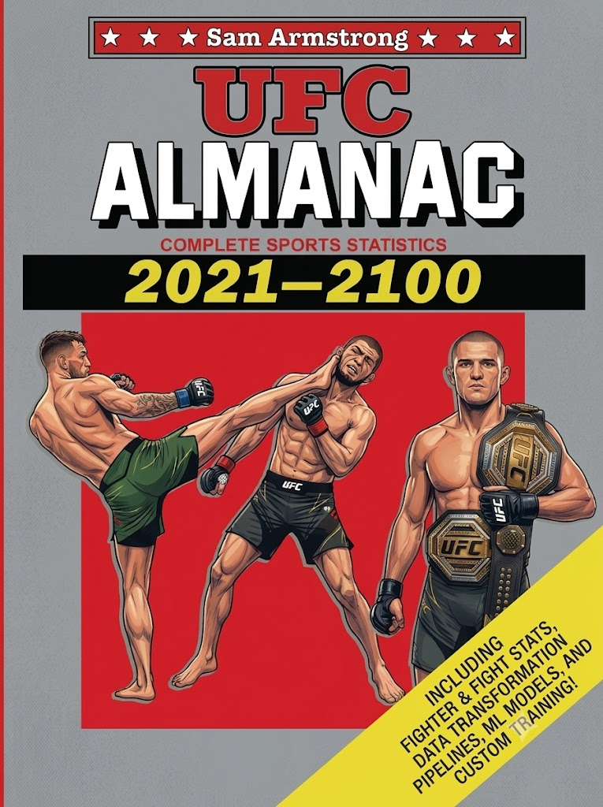

# UFC-Almanac

<div align="center">
  
</div>

A collection of datasets of UFC fight results, fight stats (both updated weekly) and fighter data (updated monthly),
containing the data for all UFC fights since 2010.
Also contains pipelines for transforming the data into formats for training machine learning models,
and training scripts for a variety of deep learning models.

## Next UFC Event Predictions

Event date: July 25, 2026

<div align="center">

| Fight | Win | Loss | Draw |
| --- | --- | --- | --- |
| Magomed Ankalaev vs Bogdan Guskov | 59.9% | 39.9% | 0.2% |
| Steve Erceg vs Ramazan Temirov | 49.0% | 50.8% | 0.2% |
| Islam Dulatov vs Wellington Turman | 71.3% | 28.5% | 0.2% |
| Rizvan Kuniev vs Tyrell Fortune | 44.0% | 55.8% | 0.2% |
| Valter Walker vs Thomas Petersen | 58.5% | 40.9% | 0.6% |
| Uran Satybaldiev vs Dustin Jacoby | 38.2% | 61.6% | 0.2% |
| Santiago Ponzinibbio vs Sam Patterson | 27.1% | 72.7% | 0.2% |
| Ismael Bonfim vs Axel Sola | 49.0% | 50.8% | 0.2% |
| Nurullo Aliev vs Mike Davis | 72.7% | 27.1% | 0.2% |

</div>


The model used for these predictions is a models/transformer_model.py trained using the following command:
```bash
ufc-train --model transformer --path artifacts/core/transformer_model.pt --epochs 50 --dropout 0.5 --num-layers 6 --restarts 10
```

*Disclaimer: These predictions are generated by a machine learning model and reflect estimated probabilities, not certainties. They are provided for informational and entertainment purposes only and should not be used as betting or financial advice.*

## Setup

```bash
pip install -e ".[all]"
```

To scrape data, install the Playwright browser:

```bash
playwright install chromium
```

## Usage

After installing the project, you can run commands either via the console scripts or the `scripts/` entrypoints.

### Scrape data (into data/*.csv files)

```bash
# Scrape fight results and stats
ufc-scrape-fights
# or
python scripts/scrape_fights.py

# Scrape fighter profiles
ufc-scrape-fighters
# or
python scripts/scrape_fighters.py
```

### Training

```bash
ufc-train --model transformer --rebuild-data
# or
python scripts/train.py --model transformer
```

#### Parameters

| Flag | Description | Default |
|------|-------------|---------|
| `--model` | Model architecture (`linear`, `mlp`, or `transformer`) | `linear` |
| `--epochs` | Number of training epochs | `40` |
| `--batch-size` | Training batch size | `256` |
| `--learning-rate` | Adam learning rate | `3e-5` |
| `--val-fraction` | Fraction of the most recent samples held out for validation | `0.1` |
| `--weight-decay` | L2 regularization strength for Adam | `3e-5` |
| `--dropout` | Dropout probability | `0.5` |
| `--d-model` | Transformer hidden dimension (`transformer` only) | `128` |
| `--num-layers` | Number of transformer encoder layers (`transformer` only) | `4` |
| `--max-fights` | Past fights per fighter / sequence length (`transformer` only) | `8` |
| `--path` | Path to save trained model weights | `<ModelName>.pt` |
| `--rebuild-data` | Regenerate training data from CSV files | off |
| `--optimize-temp` | Optimize temp scaling on the val set | off |
| `--restarts` | Number of independent training runs | `1` |

Use `--rebuild-data` when the underlying CSV data has been updated. Changing `--max-fights` also regenerates transformer training data when it does not match the saved tensors.

### Inference (predict fight outcomes)

Interactive CLI:

```bash
ufc-predict --model linear
# or
python scripts/predict.py --model mlp
```

Enter two fighter names when prompted. Type `exit`, `quit`, or `q` to stop.

#### Parameters

| Flag | Description | Default |
|------|-------------|---------|
| `--model` | Model architecture to load: `linear`, `mlp`, or `transformer` | `linear` |
| `--path` | Path to trained model weights | `<ModelName>.pt` |

The predictor loads trained weights and normalization stats from `artifacts/checkpoints/` for the selected model by default. Train a model first with `ufc-train`, or pass `--path` to load a custom checkpoint.

## Automated data updates

GitHub Actions workflows scrape new fight data weekly and fighter data monthly,
adding new data to the csv files in the `data/` directory.
