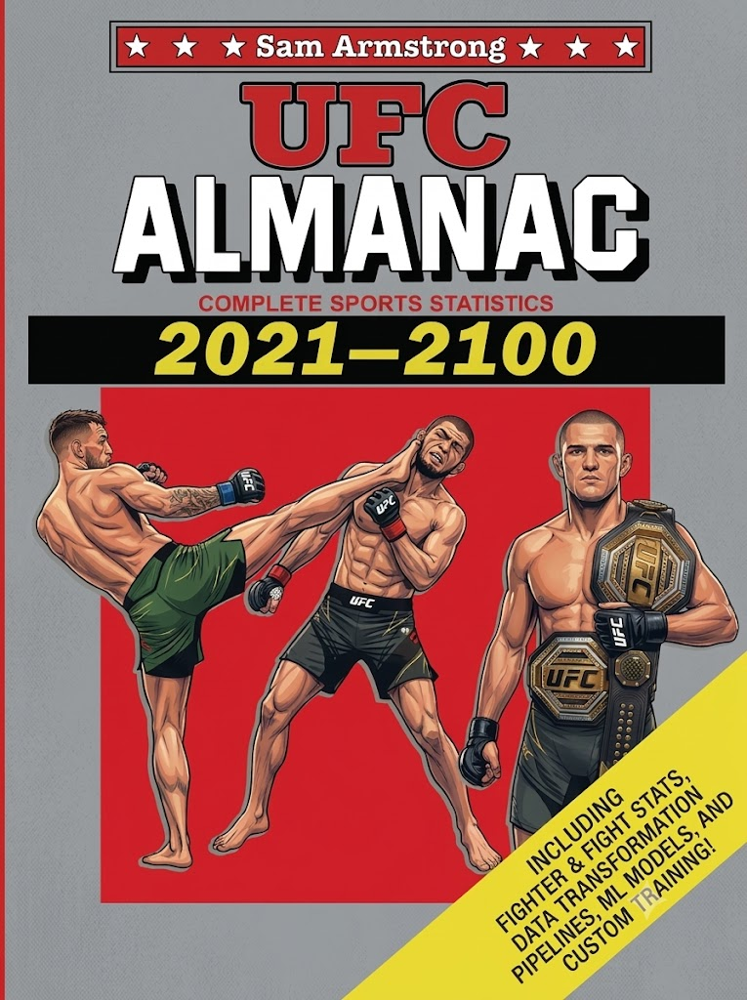

# UFC-Almanac

<div align="center">
  
</div>

A collection of datasets of UFC fight results, fight stats (both updated weekly) and fighter data (updated monthly),
containing the data for all UFC fights since 2010.
Also contains pipelines for transforming the data into formats for training machine learning models,
and training scripts for a variety of deep learning models.

## Next UFC Event Predictions

Event date: September 12, 2026

<div align="center">

<table style="margin: 0 auto; text-align: center; border-collapse: collapse; border: 1px solid #d0d7de;">
<thead>
<tr>
<th rowspan="2" style="text-align: center;">Fight</th>
<th colspan="4" style="text-align: center; border-left: 1px solid #d0d7de;">Win</th>
<th colspan="4" style="text-align: center; border-left: 1px solid #d0d7de;">Loss</th>
<th rowspan="2" style="text-align: center; border-left: 1px solid #d0d7de;">Draw</th>
</tr>
<tr>
<th style="text-align: center; border-left: 1px solid #d0d7de;"><strong>Overall</strong></th><th style="text-align: center;">KO</th><th style="text-align: center;">Sub</th><th style="text-align: center;">Dec</th>
<th style="text-align: center; border-left: 1px solid #d0d7de;"><strong>Overall</strong></th><th style="text-align: center;">KO</th><th style="text-align: center;">Sub</th><th style="text-align: center;">Dec</th>
</tr>
</thead>
<tbody>
<tr><td style="text-align: center;">Jean Silva vs Jose Delgado</td><td style="text-align: center; border-left: 1px solid #d0d7de;"><strong>37.4%</strong></td><td style="text-align: center;">14.4%</td><td style="text-align: center;">4.3%</td><td style="text-align: center;">18.7%</td><td style="text-align: center; border-left: 1px solid #d0d7de;"><strong>61.7%</strong></td><td style="text-align: center;">20.3%</td><td style="text-align: center;">9.9%</td><td style="text-align: center;">31.5%</td><td style="text-align: center; border-left: 1px solid #d0d7de;">0.8%</td></tr><tr><td style="text-align: center;">Brandon Moreno vs Joseph Morales</td><td style="text-align: center; border-left: 1px solid #d0d7de;"><strong>58.5%</strong></td><td style="text-align: center;">12.7%</td><td style="text-align: center;">9.9%</td><td style="text-align: center;">35.9%</td><td style="text-align: center; border-left: 1px solid #d0d7de;"><strong>41.1%</strong></td><td style="text-align: center;">5.5%</td><td style="text-align: center;">12.9%</td><td style="text-align: center;">22.7%</td><td style="text-align: center; border-left: 1px solid #d0d7de;">0.5%</td></tr><tr><td style="text-align: center;">Tommy McMillen vs Marwan Rahiki</td><td style="text-align: center; border-left: 1px solid #d0d7de;"><strong>55.0%</strong></td><td style="text-align: center;">21.5%</td><td style="text-align: center;">5.7%</td><td style="text-align: center;">27.8%</td><td style="text-align: center; border-left: 1px solid #d0d7de;"><strong>44.3%</strong></td><td style="text-align: center;">21.4%</td><td style="text-align: center;">5.8%</td><td style="text-align: center;">17.1%</td><td style="text-align: center; border-left: 1px solid #d0d7de;">0.8%</td></tr><tr><td style="text-align: center;">Manon Fiorot vs Alexa Grasso</td><td style="text-align: center; border-left: 1px solid #d0d7de;"><strong>54.2%</strong></td><td style="text-align: center;">6.3%</td><td style="text-align: center;">2.7%</td><td style="text-align: center;">45.2%</td><td style="text-align: center; border-left: 1px solid #d0d7de;"><strong>45.2%</strong></td><td style="text-align: center;">8.7%</td><td style="text-align: center;">4.3%</td><td style="text-align: center;">32.2%</td><td style="text-align: center; border-left: 1px solid #d0d7de;">0.5%</td></tr><tr><td style="text-align: center;">Waldo Cortes Acosta vs Curtis Blaydes</td><td style="text-align: center; border-left: 1px solid #d0d7de;"><strong>63.3%</strong></td><td style="text-align: center;">46.1%</td><td style="text-align: center;">3.0%</td><td style="text-align: center;">14.2%</td><td style="text-align: center; border-left: 1px solid #d0d7de;"><strong>36.1%</strong></td><td style="text-align: center;">17.1%</td><td style="text-align: center;">1.8%</td><td style="text-align: center;">17.2%</td><td style="text-align: center; border-left: 1px solid #d0d7de;">0.6%</td></tr><tr><td style="text-align: center;">David Martinez vs Dan Ige</td><td style="text-align: center; border-left: 1px solid #d0d7de;"><strong>72.1%</strong></td><td style="text-align: center;">6.6%</td><td style="text-align: center;">2.2%</td><td style="text-align: center;">63.3%</td><td style="text-align: center; border-left: 1px solid #d0d7de;"><strong>27.5%</strong></td><td style="text-align: center;">6.1%</td><td style="text-align: center;">1.9%</td><td style="text-align: center;">19.5%</td><td style="text-align: center; border-left: 1px solid #d0d7de;">0.3%</td></tr><tr><td style="text-align: center;">Tim Elliott vs Edgar Chairez</td><td style="text-align: center; border-left: 1px solid #d0d7de;"><strong>43.4%</strong></td><td style="text-align: center;">5.2%</td><td style="text-align: center;">9.0%</td><td style="text-align: center;">29.2%</td><td style="text-align: center; border-left: 1px solid #d0d7de;"><strong>56.0%</strong></td><td style="text-align: center;">7.5%</td><td style="text-align: center;">17.3%</td><td style="text-align: center;">31.2%</td><td style="text-align: center; border-left: 1px solid #d0d7de;">0.5%</td></tr><tr><td style="text-align: center;">Ignacio Bahamondes vs Muslim Salikhov</td><td style="text-align: center; border-left: 1px solid #d0d7de;"><strong>76.5%</strong></td><td style="text-align: center;">37.5%</td><td style="text-align: center;">16.2%</td><td style="text-align: center;">22.8%</td><td style="text-align: center; border-left: 1px solid #d0d7de;"><strong>22.7%</strong></td><td style="text-align: center;">8.9%</td><td style="text-align: center;">1.6%</td><td style="text-align: center;">12.2%</td><td style="text-align: center; border-left: 1px solid #d0d7de;">0.7%</td></tr><tr><td style="text-align: center;">Yousri Belgaroui vs Djorden Santos</td><td style="text-align: center; border-left: 1px solid #d0d7de;"><strong>62.4%</strong></td><td style="text-align: center;">25.4%</td><td style="text-align: center;">7.1%</td><td style="text-align: center;">29.9%</td><td style="text-align: center; border-left: 1px solid #d0d7de;"><strong>37.2%</strong></td><td style="text-align: center;">19.7%</td><td style="text-align: center;">3.6%</td><td style="text-align: center;">13.9%</td><td style="text-align: center; border-left: 1px solid #d0d7de;">0.4%</td></tr><tr><td style="text-align: center;">Drakkar Klose vs Tommy Gantt</td><td style="text-align: center; border-left: 1px solid #d0d7de;"><strong>15.0%</strong></td><td style="text-align: center;">5.9%</td><td style="text-align: center;">2.0%</td><td style="text-align: center;">7.1%</td><td style="text-align: center; border-left: 1px solid #d0d7de;"><strong>84.4%</strong></td><td style="text-align: center;">14.3%</td><td style="text-align: center;">24.4%</td><td style="text-align: center;">45.7%</td><td style="text-align: center; border-left: 1px solid #d0d7de;">0.6%</td></tr><tr><td style="text-align: center;">Rafa Garcia vs Rongzhu</td><td style="text-align: center; border-left: 1px solid #d0d7de;"><strong>51.0%</strong></td><td style="text-align: center;">7.6%</td><td style="text-align: center;">8.7%</td><td style="text-align: center;">34.7%</td><td style="text-align: center; border-left: 1px solid #d0d7de;"><strong>48.5%</strong></td><td style="text-align: center;">11.5%</td><td style="text-align: center;">5.2%</td><td style="text-align: center;">31.8%</td><td style="text-align: center; border-left: 1px solid #d0d7de;">0.6%</td></tr><tr><td style="text-align: center;">JJ Aldrich vs Regina Tarin</td><td style="text-align: center; border-left: 1px solid #d0d7de;"><strong>39.4%</strong></td><td style="text-align: center;">4.4%</td><td style="text-align: center;">5.9%</td><td style="text-align: center;">29.1%</td><td style="text-align: center; border-left: 1px solid #d0d7de;"><strong>60.2%</strong></td><td style="text-align: center;">10.1%</td><td style="text-align: center;">6.0%</td><td style="text-align: center;">44.1%</td><td style="text-align: center; border-left: 1px solid #d0d7de;">0.5%</td></tr>
</tbody>
</table>

</div>


The model used for these predictions is a models/transformer_model.py trained using the following command:
```bash
ufc-train --model transformer --path artifacts/core/transformer_model.pt --epochs 75 --dropout 0.5 --num-layers 1 --restarts 10 --d-model 32 --learning-rate 1e-4 --weight-decay 1e-4
```

*Disclaimer: These predictions are generated by a machine learning model and reflect estimated probabilities, not certainties. They are provided for informational and entertainment purposes only and should not be used as betting or financial advice.*

## Setup

```bash
pip install -e ".[all]"
```

To scrape data, install the Playwright browser:

```bash
playwright install chromium
```

## Usage

After installing the project, you can run commands either via the console scripts or the `scripts/` entrypoints.

### Scrape data (into data/*.csv files)

```bash
# Scrape fight results and stats
ufc-scrape-fights
# or
python scripts/scrape_fights.py

# Scrape fighter profiles
ufc-scrape-fighters
# or
python scripts/scrape_fighters.py
```

### Training

```bash
ufc-train --model transformer --rebuild-data
# or
python scripts/train.py --model transformer
```

#### Parameters

| Flag | Description | Default |
|------|-------------|---------|
| `--model` | Model architecture (`linear`, `mlp`, or `transformer`) | `linear` |
| `--epochs` | Number of training epochs | `40` |
| `--batch-size` | Training batch size | `256` |
| `--learning-rate` | Adam learning rate | `3e-5` |
| `--val-fraction` | Fraction of the most recent samples held out for validation | `0.1` |
| `--weight-decay` | L2 regularization strength for Adam | `3e-5` |
| `--dropout` | Dropout probability | `0.5` |
| `--d-model` | Transformer hidden dimension (`transformer` only) | `128` |
| `--num-layers` | Number of transformer encoder layers (`transformer` only) | `4` |
| `--max-fights` | Past fights per fighter / sequence length (`transformer` only) | `8` |
| `--path` | Path to save trained model weights | `<ModelName>.pt` |
| `--rebuild-data` | Regenerate training data from CSV files | off |
| `--optimize-temp` | Optimize temp scaling on the val set | off |
| `--restarts` | Number of independent training runs | `1` |

Use `--rebuild-data` when the underlying CSV data has been updated. Changing `--max-fights` also regenerates transformer training data when it does not match the saved tensors.

### Inference (predict fight outcomes)

Interactive CLI:

```bash
ufc-predict --model linear
# or
python scripts/predict.py --model mlp
```

Enter two fighter names when prompted. Type `exit`, `quit`, or `q` to stop.

#### Parameters

| Flag | Description | Default |
|------|-------------|---------|
| `--model` | Model architecture to load: `linear`, `mlp`, or `transformer` | `linear` |
| `--path` | Path to trained model weights | `<ModelName>.pt` |

The predictor loads trained weights and normalization stats from `artifacts/checkpoints/` for the selected model by default. Train a model first with `ufc-train`, or pass `--path` to load a custom checkpoint.

## Automated data updates

GitHub Actions workflows scrape new fight data weekly and fighter data monthly,
adding new data to the csv files in the `data/` directory.
